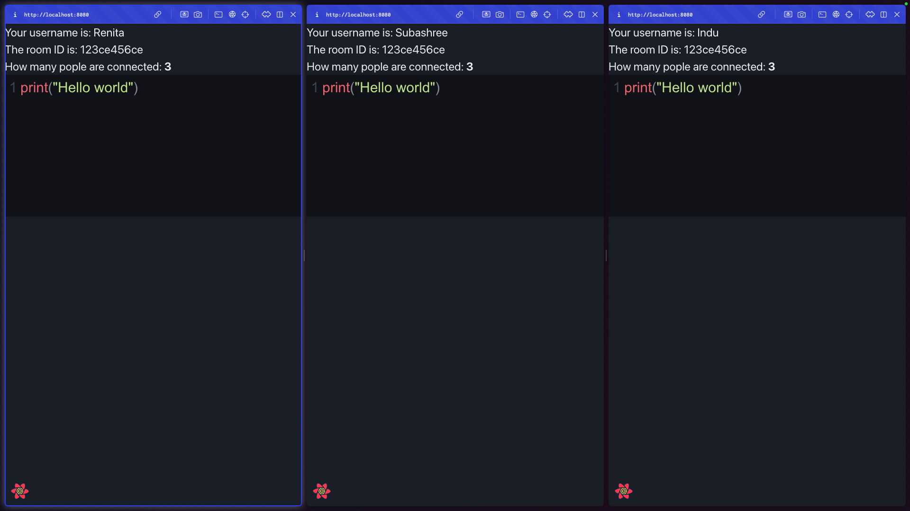

# CodeTogether-Synchronized-Coding-and-Collaboration-in-Real-Time

# 

CodeTogether is a realtime collaborative code editor.


## Table of Contents
1. [Setup](#setup)
2. [Technologies Used](#built-with)
3. [Screenshots](#screenshots)
4. [Team](#team)


## Setup

Follow these steps to install and run CodeTogether locally:

1. Clone the repository:
```bash
$ git clone "https://github.com/cu-csci-4253-datacenter-fall-2024/finalproject-team-99.git"
$ cd finalproject-team-99
```
2. Build the project:
```bash
$ make all
```
3. Deploy the application:
```bash
$ ./deployment.sh
```
4. Port Forward the necessary services

```bash
kubectl port-forward svc/frontend 8080:80
kubectl port-forward svc/prometheus-kube-prometheus-prometheus 9090:9090
kubectl port-forward svc/prometheus-kube-prometheus-alertmanager 9093:9093
kubectl port-forward svc/prometheus-grafana 8081:80
```
   
5. Access the application:
Code Editor: [https://localhost:8080](https://localhost:8080)
Prometheus: [https://localhost:9090](https://localhost:9090)
Grafana: [https://localhost:8081](https://localhost:8081)

## Built with
- ReactJS - A JavaScript library for building user interfaces
- CodeMirror - CodeMirror is a versatile text editor implemented in JavaScript for the browser.
- NodeJS - Node.js® is a JavaScript runtime built on Chrome's V8 JavaScript engine.
- ExpressJS - Built on top of Node.js® to write APIs
- Socket.io - Socket.IO enables real-time, bidirectional and event-based communication.
- Redis - An in-memory data store managing session data and Pub/Sub for real-time updates.
- Docker and Kubernetes -  Tools for containerization and scalable orchestration of the application.
- Prometheus and Grafana - Deployed through kube-prometheus-stack for monitoring system metrics.
  
## Screenshots

# 

# 


## Team
- Indu Varshini Jayapal - [InduVarshini](https://github.com/InduVarshini)
- Renita Blessina - [RenitaBlessina](https://github.com/RenitaBlessina)
- Subashree Dinesh - [Subashree1503](https://github.com/Subashree1503)


Service port numbers on kubernetes

| Service | Port | TargetPort |
| -------- | ------- | -------- |
| frontend | 80 | 80 |
| api-gateway | 3100 | 3100 |	
| socket-service | 3200 | 3200 |
| user-service | 3300 | 3300 |
| room-service | 3400 | 3400 |
| code-service | 3500 |	3500 |	
| prometheus | 9090 |	9090 |
| grafana | 8081 |	3000 |

