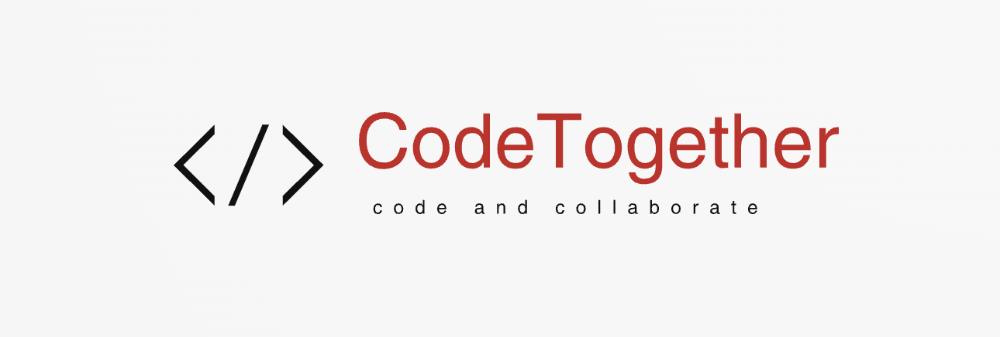
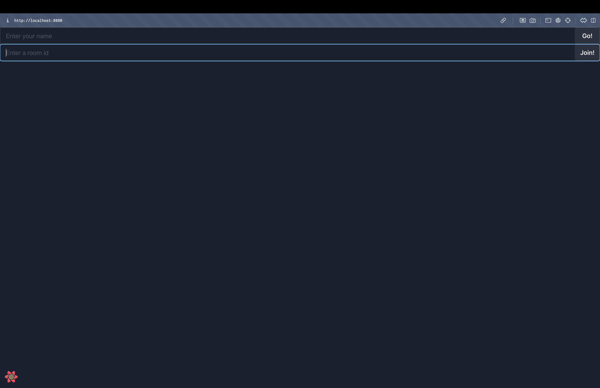

# CodeTogether-Synchronized-Coding-and-Collaboration-in-Real-Time

# 


CodeTogether is a realtime collaborative code editor.


## Table of Contents
1. [Installation and Setup](#installation-and-setup)
2. [Technologies Used](#built-with)
3. [Features](#features)
4. [Screenshots](#screenshots)
5. [Team](#team)


## Installation and Setup

Follow these steps to install and run CodeTogether locally:

1. Clone the repository:
```bash
$ git clone "https://github.com/cu-csci-4253-datacenter-fall-2024/finalproject-team-99.git"
```
2. Build the project:
```bash
$ make
```
3. Deploy the application:
```bash
$ ./deployment.sh
```

## Built with
- ReactJS - A JavaScript library for building user interfaces
- CodeMirror - CodeMirror is a versatile text editor implemented in JavaScript for the browser.
- NodeJS - Node.js® is a JavaScript runtime built on Chrome's V8 JavaScript engine.
- Socket.io - Socket.IO enables real-time, bidirectional and event-based communication.

## Features

## Screenshots

# 

# 


## Team
- Subashree Dinesh - [Subashree1503](https://github.com/Subashree1503)
- Indu Varshini - [InduVarshini](https://github.com/InduVarshini)
- Renita Blessina - [RenitaBlessina](https://github.com/RenitaBlessina)


